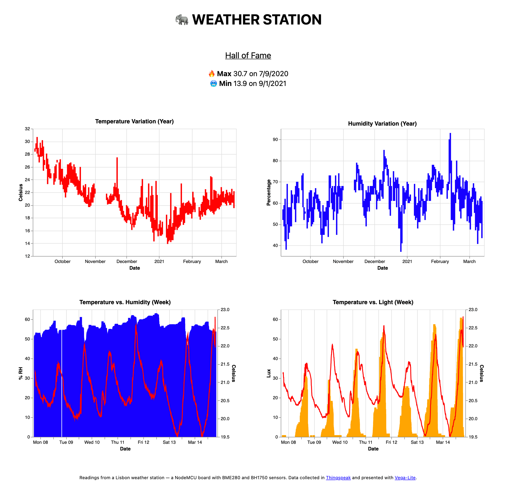

# Elefantempo
 
_Elefantempo_ is the name of a weather station I started building in the summer of 2020. Weather stations are among the most popular Arduino projects you can find online, since they allow you to engage with basic circuit design, sensors, and a little bit of C++, while adding something mildly useful to one's home. They can range from basic termometers coupled with LCDs to fully-autonomous systems the size of a football.

This example uses an ESP8266 NodeMCU development board, a BME280 temperature, humidity and barometric pressure sensor, a BH1750 surface light sensor, and a 0.96" OLED display. Data points are sent to a Thingspeak channel every 5 minutes, and immediately forwarded to a Google Sheet and an Airtable. Thingspeak also runs a daily MATLAB analysis that calculates each day's maximum, minimum and averages. Finally, the Thingspeak API feeds a Netlify website with a set of charts, made with Vega-Lite.

## The circuit

The circuit is still mounted to a breadboard, since I haven't yet decided if I should add more sensors to it. It also happens to sit completely flat, which I find very convenient. The breadboard can be easily glued to a vertical surface, since it has an adhesive on the back. Other than the sensors, I added a button to activate the display whenever I pass by the station and want to know what it is measuring at the time. The display will also show an error code if the connection to Thingspeak fails.

## The code

The sketch flashed to the Arduino is the file `elefantempo.ino` and it sits on the root of this repository. Since I was often connecting/disconnecting the board during the early days of the project, the first records were unevely timed. I then added a remote NTP clock check during setup, so the loop waits _exactly_ until the next 5-minute mark to start. After that, the clock service is disconnected and the loop is timed with `millis()`. 

## The website

## Previous iterations

Before the current version, I also tried:

* An Arduino Uno with a basic temperature sensor. I realised I didn't want to have it connected to my computer all the time and that I was interested in recording data over time.
* A Seeduino Xiao with a DHT11, an RTC clock, and an SD Module. This worked autonomously rather well, but the RTC blinked too much, and I figured I didn't want to unplug the SD card and connect it to my computer whenever I wanted to check the measures.
* An Arduino MKR1010 with a DHT11 and an OLED display. This worked for a few months, sending data to Airtable directly. However, it also failed every couple of days, forcing me to reset it. There is also a well-documented bug with the CHRG led that makes it blink out of the blue, which can be a pain in a dark room.
* I stopped at the current setup since it fits a single breadboard and has no blinking lights (also turned the OLED off for that reason). The NodeMCU can operate for weeks without errors. Moving to Thingspeak seems to have helped, and it is very easy to manipulate data once it's there. I changed the visualization from an embedded Airtable chart to Vega because it loads instantly on the page.

## Estimated costs (in Euros)

* NodeMCU (8€)
* BME280 (6.5€)
* BH1750 (5.5€)
* OLED (5.5€)
* USB cable + charger (5€)
* Breadboard (1€)

That's 31.5€ in total. These prices do not include shipping and handling, but some stores will offer it for free if you buy these components together. All of them get cheaper if you buy in bulk, so the project could easily come down to 20€ if one were to make a few more. I also used the cable+charger from an old smartphone. 

## Future iterations

* Smaller: seems like using a smaller board with better low-power functions (like the Wemos D1) would allow the station to run from a power bank for a few months. This would allow it to be posted on a balcony. A client-peripheral scheme using BLE or LoRa would also be much less power hungry than WiFi.
* More complex: the Raspberry Pi Zero W and Google's Coral Environment Sensor can easily be coupled together (and cost some 40€). Using the Pi allows for adding beefier tasks, like a landscape camera, or dual microphones for measuring ambient noise, with maybe some machine learning on top.
* Solar: a full solar power array would need a panel, some extra controllers, and a battery, preferably not Li-Po since they have issues charging under load (lead acid or LiFePo4 are better). The setup can cost up to 50€.
